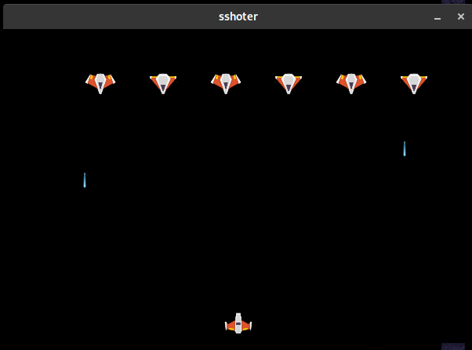

# SShooter

SShooter is made with python and arcade.

<p align="center">
	<a href="">
		
	</a>
</p>

## How to run

Create a virtual env:

```bash
$ mkvirtualenv --python=python3.6 sshooter
```

If you alredy have the enviroment:

```bash
$ workon sshooter
```

Install all dependencies: 

```bash
$ pip install -r requirements.txt
```

Run:

```bash
$ python src/main.py
```

## Author

* **Rafael Coelho** - [rafaellcoellho](https://github.com/rafaellcoellho)

## Reference 

+ [coding train video](https://www.youtube.com/watch?v=biN3v3ef-Y0&t=1732s)
